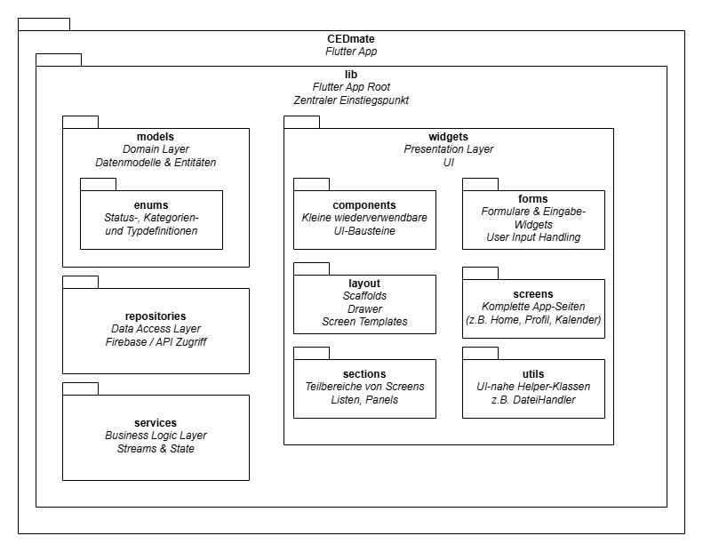

# CEDmate

CEDmate ist eine mobile Flutter-App zur Unterstützung von Menschen mit chronisch-entzündlichen
Darmerkrankungen (CED) wie Morbus Crohn oder Colitis ulcerosa.

Die App dient als Studien- und Demonstrationsprojekt und ermöglicht die strukturierte
Erfassung von Symptomen, Ernährung, psychischem Wohlbefinden und Krankheitsverlauf.

https://ahmad-kalaf.github.io/CEDmate/

Hinweis zur Online-Version:
Die auf GitHub Pages bereitgestellte Web-App dient ausschließlich Demonstrationszwecken
und ist nicht für produktiven oder kommerziellen Einsatz vorgesehen.

---

## Projektstruktur

```text
CEDmate
│
└─ lib
   ├─ models
   │  └─ enums
   │
   │  Beschreibung:
   │  - Domain Layer
   │  - Datenmodelle und Entitäten
   │  - enums: Status-, Kategorien- und Typdefinitionen
   │
   ├─ repositories
   │
   │  Beschreibung:
   │  - Data Access Layer
   │  - Kommunikation mit Firebase und APIs
   │
   ├─ services
   │
   │  Beschreibung:
   │  - Business Logic Layer
   │  - Anwendungslogik
   │  - Streams und State Management
   │
   └─ widgets
      ├─ components
      │
      │  Beschreibung:
      │  - Kleine wiederverwendbare UI-Bausteine
      │
      ├─ forms
      │
      │  Beschreibung:
      │  - Formulare und Eingabe-Widgets
      │  - User Input Handling
      │
      ├─ layout
      │
      │  Beschreibung:
      │  - Scaffolds
      │  - Drawer
      │  - Screen Templates
      │
      ├─ screens
      │
      │  Beschreibung:
      │  - Komplette App-Seiten
      │  - z.B. Home, Profil, Kalender
      │
      ├─ sections
      │
      │  Beschreibung:
      │  - Teilbereiche von Screens
      │  - Listen, Panels, Inhaltsblöcke
      │
      └─ utils
         │
         │  Beschreibung:
         │  - UI-nahe Helper-Klassen
         │  - z.B. DateiHandler
```

---

## Ordnerstruktur




---

## Lizenz

Dieses Projekt steht unter einer modifizierten MIT-Lizenz mit nicht-kommerzieller Nutzung
und Zustimmungspflicht aller Autorinnen und Autoren.

Kommerzielle Nutzung, Weitergabe oder Veröffentlichung sind nur mit dem
schriftlichen Einverständnis aller beteiligten Personen erlaubt:

Ahmad Kalaf  
Afrane Kwame Berquin  
Miriam Schwarz  
Aliena Glatzel  
Larissa Pychlau  
Benedict Löhn

Siehe LICENSE für den vollständigen Lizenztext.
